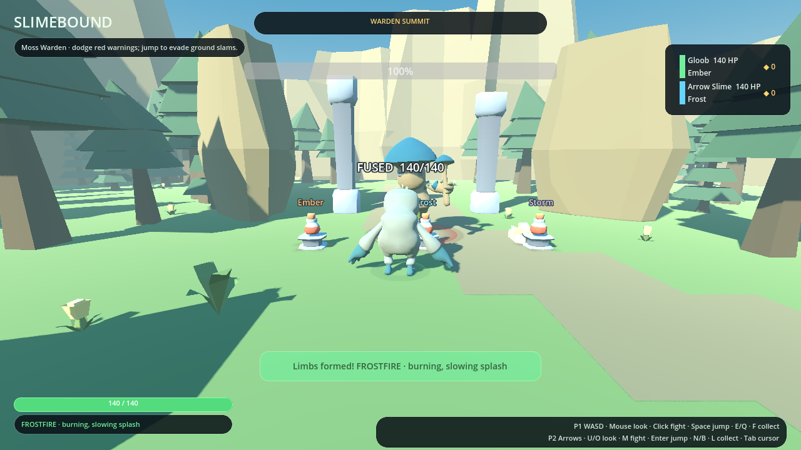

# Slimebound — build 0.9: The Wilds

A Godot 4.3+ third-person co-op exploration prototype with two connected maps. Follow an outdoor trail from a campsite, through pine groves and uphill ridges, to the Moss Warden's summit. Slimes split to explore and gather powers, then fuse to fight.



This is a **bounded outdoor level**, not a finished open-world game or a PEAK clone. It has sloped terrain and jumping, but not climbing, procedural islands, swimming, quests, save games or audio yet.

## Run the new build

1. Download the latest repository ZIP and extract it into a **fresh folder**.
2. Import `project.godot` in Godot 4.3 or newer. Allow the bundled GLB models to import.
3. Press F5. Confirm the menu says **BUILD 0.9 · THE WILDS · THIRD-PERSON CO-OP**.
4. Select **PLAY LOCAL DUNGEON — NO IP REQUIRED** for two players on one keyboard. This familiar button now starts the outdoor expedition.

## Camera and local controls

The camera stays **third-person in every form**. Separate local slimes each get a split-screen view. Fusion merges the screens and smoothly pulls the camera back to frame the larger body. Splitting restores two views. Mouse look belongs to player 1; player 2 can orbit using U/O. In the shared fused view, both mouse and U/O turn the camera. Movement is camera-relative.

| Action | Player 1 | Player 2 |
| --- | --- | --- |
| Move | WASD | Arrow keys |
| Orbit camera | Mouse (right-click to capture) | U / O |
| Tilt camera | Mouse up/down, or T / G | I / K |
| Zoom | Mouse wheel | [ / ] |
| Reset both cameras | Home | Home |
| Jump | Space | Enter |
| Hold sprint | Shift | Ctrl |
| Attack, fused only | Left mouse | M (nearby enemy auto-aim) |
| Offer fusion | E | N |
| Split | Q | B |
| Collect nearby power, solo only | F | L |
| Release / capture mouse | Tab | Tab |
| Restart expedition | R (host) | — |
| Return to menu | Escape | Escape |

Stand close and offer fusion within three seconds of each other. Both players steer the shared body: opposing movement cancels out; an idle partner no longer reduces speed. Every member must consent to larger online fusions. Any member can split.

Space now jumps; it no longer attacks. Mouse look aims player 1's ground-following spell attacks. These are not free-aim vertical projectiles.

## Explore the route

- **Trailhead:** campsite, movement practice and three replenishing power pickups.
- **Whispering Grove:** follow the winding trail uphill and approach the ruined landmark **while fused** to begin a four-enemy encounter.
- **Sunlit Ridge:** after clearing the grove, continue to the second landmark and its six-enemy encounter.
- **Warden Summit:** after the ridge, reach the final clearing to awaken the 1,800-HP Moss Warden. It has telegraphed slams, radial volleys, summoned crawlers and a faster second phase below half health.
- **Summit arch:** defeat the Warden and enter the arch together to finish.

There are no room gates or transition teleports. You can wander and backtrack throughout the valley, but encounters activate in order and require a fused party. Three extra power caches lie off the trail. Distant mountain meshes are scenery, not additional playable regions.

Jump or move out of red ground-slam warnings. Terrain climbs 8.4 metres between trailhead and summit. Trees and landmark boulders block movement; the camera pulls in around them. Decorative foliage is non-colliding.

Defeat reforms the team at its latest active landmark, retaining powers and resetting that encounter. R resets the expedition, powers and score.

## Slime abilities

Solo slimes cannot attack directly, but equipped powers add minor trail effects. Moving on the ground leaves a seven-second trail: ordinary enemies move 55% slower on it, and the Warden moves 30% slower. Solo slimes move faster and start with one power slot. Extra slots unlock at levels 3, 6 and 9. Collecting powers fills empty slots, then replaces the oldest carried power when full; pickups replenish after one second.

Fusion uses an existing animated green slime model with small arms, enables melee strikes and activates equipped powers. Splitting retains each player's power and health percentage; it does not heal them.

| Equipped powers | Fused effect |
| --- | --- |
| Ember | Added impact damage and burning |
| Frost | Added impact damage and slowing |
| Storm | Added impact damage and chain damage |
| Two of the same | Double elemental damage; double burn/chain damage or frost duration |
| Ember + Frost | Frostfire: burning impact and slowing splash |
| Ember + Storm | Plasma: splash and burning chains |
| Frost + Storm | Blizzard: slowing chains |
| All three, 3+ players | Tempest: burn, frost, chain and splash |

Matching powers multiply the elemental portion, not the physical base strike. No friendly fire.

## Online play

Host/Join supports up to six players on UDP **7777**. Internet play may need port forwarding; there is no relay or matchmaking. Each online player has a third-person orbit camera, including when controlling a shared fused body. The host simulates movement, powers, enemies, progression and victory. Local Dungeon never opens a server port.

## Public assets only

All model and effect art is bundled CC0 work by Kenney and Quaternius. The outdoor environment uses **Kenney Nature Kit**. Layout, asset transforms, engine material palette/roughness adjustments, standard sky, fog and lighting are configured in code. No custom artwork meshes or textures were created.

The fused form uses Quaternius’s CC0 **Slime**, with small arms and existing animations, enlarged in-game. The Warden uses **Mushroom King**. See [ASSET_CREDITS.md](ASSET_CREDITS.md) and the included license files.

## Developer checks

```sh
godot --headless --editor --import --quit
godot --headless --script res://tests/gameplay_test.gd
```

The gameplay test covers solo restrictions, trails, powers, fusion, boss phases, victory, jumping, terrain, a clear traversal route, split-screen and fused third-person framing. Godot 4.3's dummy renderer may print `mesh_get_surface_count` during resource cleanup; check the test results and exit status for failures.

For networking, run `godot --headless --script res://tests/network_test.gd -- --server`, then launch `godot --headless --script res://tests/network_test.gd` in another terminal within one second. For rendered captures, run `godot --script res://tests/visual_check.gd`; images go to `user://screenshots` unless `SLIME_SCREENSHOT_DIR` is set.

## Movement and shared levels (build 0.6)

Walking is 9 units/second solo and 7.6 fused. Hold sprint for 1.7× speed; either moving member can sprint the fused body. Acceleration and braking soften starts and stops. Camera orbit is smoothed, follows the rendered slime each frame, and retracts around obstacles with a gradual release. Online characters interpolate buffered snapshots (120 ms) rather than stepping between network updates.

The party shares XP: crawlers grant 25, brutes 45, the boss 250, new landmarks 40, and each exploration cache 35. Rewards are claimed once per expedition; ordinary power pedestals and boss summons grant no XP. Level 2 requires 100 XP, with each subsequent level costing 50 more. Each level adds 10 maximum health per slime (and heals that amount) and 12% of base fusion damage, including elemental effects. Maximum level is 10. The HUD shows level and progress to the next level.

Levels survive defeat and splitting/fusion. R starts a fresh expedition at level 1; there is no saved progression between sessions.

Additional regression test: `godot --headless --path . --script res://tests/movement_level_test.gd`.

## Power slots, jump feel and projectiles (build 0.7)

Each slime has 1/2/3/4 power slots at party levels 1/3/6/9. Collect while solo to fill them; when full, the oldest power is replaced. Duplicates stack, and fusion pools every member’s slots. Splitting or defeat retains inventories. The roster shows each slime’s powers and slot usage. A new expedition clears them.

Jump with Space / Enter. Hold for the full jump, release early for a short hop. Jump input is buffered for 140 ms before landing, with 100 ms of coyote time after leaving ground. Falling is faster than rising; existing models stretch in the air and squash briefly on landing. Either fused player can jump or shorten the shared jump.

Projectiles have larger colored silhouettes, white centers and directional sprite trails; hostile shots have red rings. Impact flashes mark hits. All effects reuse the bundled Kenney particle artwork. Shots remain ground-following spells, not vertically aimed projectiles.

## Amber Ruins and camera update (build 0.8)

The fused slime is now 1.85 m tall instead of 3.2 m. The default camera looks down from a higher angle and supports a wider tilt range. Right-click captures mouse look, Tab releases it, and Home restores the default angle and zoom. Controls above include keyboard tilt and zoom for player two.

Clear the Wilds and enter its exit arch while fused, then the **host presses F8** to travel to Amber Ruins. Levels and carried powers survive travel. R resets the entire expedition to the Wilds. Online clients automatically rebuild the correct map from the host snapshot, including late joiners.

Amber Ruins is a first playable version: a sandy canyon with Caravan Camp, Broken Court, Pillar Pass, Amber Sanctum, two combat encounters, five power pedestals at each landmark, three side caches, and an exit. The Amber Warden currently reuses the first boss’s model and attack patterns with 40% more health (2,520 HP), as do other enemies on this map; it is not a new bespoke boss yet. Both maps use the existing licensed models.

### New powers in Amber Ruins

Venom applies poison; Gale knocks enemies back with collision checks (bosses resist most knockback). Duplicate powers increase their effects. Existing powers remain available.

| Fused combination | Effect |
| --- | --- |
| Venom + Gale — Toxic Cyclone | Poison spreads through a knockback gust |
| Venom + Ember — Volatile Venom | Poison, burning, and extra impact damage |
| Venom + Frost — Deep Chill | Longer poison duration and slowing |
| Venom + Storm — Plague Arc | Chain lightning spreads poison |
| Gale + Ember — Firestorm | A gust spreads burning |
| Gale + Frost — Squall | A gust spreads slowing |
| Gale + Storm — Thunderclap | A gust deals extra shock damage alongside chaining |

Three or more different elements involving Venom or Gale display as **Prism Surge** and retain their constituent effects.

### Solo elemental trails

| Equipped power | Minor trail effect |
| --- | --- |
| Ember | 3 damage per second per stack to touching enemies |
| Frost | Allies gain 12% speed per stack and lower braking/turning friction |
| Venom | 1.5 poison damage per second per stack, lingering for 1.5 seconds |
| Storm | 2 damage per stack every 0.8 seconds |
| Gale | Allies gain 15% speed per stack; enemies are gently pushed away |

All allied bodies, including fused bodies and the trail’s owner, benefit. Combined speed boosts cap at 35%. Overlapping patches use the strongest stack count for each element, capped at four; more patches do not multiply damage. Empty trails still slow enemies. Trails last seven seconds and are tinted by their carried elements. Jumping out of contact avoids the ground speed/friction effects. Solo trails remain deliberately weaker than fused attacks.

Additional checks: `tests/ruins_camera_test.gd` and `tests/trail_test.gd`. The network test now verifies transition to map two and inventory replication.

## Traversal, combat and effects (build 0.9)

- **Opaque projectiles:** a solid, unshaded Kenney rock mesh forms the colored shot, while the core and tail sprites use alpha discard: their visible pixels are solid, depth-writing shapes, with white cores and solid colored tails. Transparent pixels outside the silhouette are discarded. Enemy bolts are red. They no longer fade into the terrain as translucent puffs.
- **Fusion and splitting:** merging pulls the two source models inward and pops the fused model into view; splitting sends the solo models outward in a short hop. A ring pulse accompanies both. These are visual effects only, lasting about half a second; they do not pause input or change health, powers or collision state. Transition data is included in online snapshots.
- **Jumpable terrain:** both maps have three stone steps west of the starting trail, with an exploration power cache on the highest step. Jump onto their tops, land and jump again. Solid sides and low roofs have height-aware collision.
- **Twin Seals puzzle:** after clearing Broken Court in Amber Ruins, split and enter the two low-roof alcoves at x = -24 and +24, z = -8. Each requires a solo slime. Hold one seal each simultaneously for one second to unlock Pillar Pass and earn 80 party XP. It stays unlocked through defeat. The roof prevents fusion inside, while the seal check prevents solving it from the roof. Regroup and fuse to continue.
- **New enemies:** Quaternius CC0 skeletons keep their distance and launch red bolts after a 0.55-second warning. Bats hover low and dash after a warning. They join crawlers and mushroom brutes in both maps’ encounters. Bats remain low enough to be hit by ground-following spells and elemental trails.
- **Difficulty:** crawlers now have 85 HP, brutes 150, skeletons 100, bats 75 and the first boss 1,800. Map two multiplies these by 1.4. Ground enemies move faster and melee hits deal 14 damage, or 22 from brutes. Boss attack patterns are unchanged.

Run `godot --headless --path . --script res://tests/traversal_effect_test.gd` to check platform landing, headroom, the co-op puzzle, solid projectile settings, transformation effects and skeleton attack timing.
